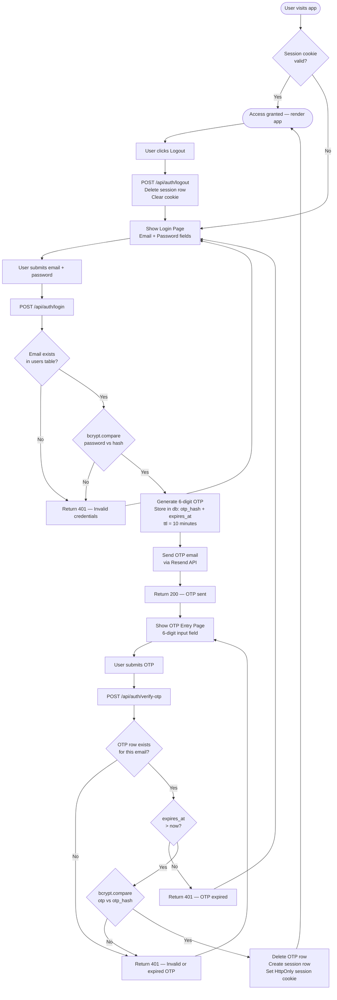

# Authentication Spec — AK Calendar

## Overview

Replace the current hardcoded client-side credential check with a proper server-side authentication system. Users will authenticate with their email and password; upon successful credential verification a one-time passcode (OTP) is emailed to them. Entering the correct OTP completes login and creates a server-side session.

---

## Authentication Flow



---

## Database Schema

### Migration 005 — Create users table

```sql
-- scripts/005_create_users_table.sql

CREATE TABLE IF NOT EXISTS users (
  id          SERIAL PRIMARY KEY,
  email       TEXT NOT NULL UNIQUE,
  password_hash TEXT NOT NULL,
  role        TEXT NOT NULL DEFAULT 'admin',   -- 'admin' | 'staff'
  created_at  TIMESTAMPTZ NOT NULL DEFAULT NOW(),
  updated_at  TIMESTAMPTZ NOT NULL DEFAULT NOW()
);

CREATE INDEX idx_users_email ON users(email);
```

### Migration 006 — Create auth tables (OTP + sessions)

```sql
-- scripts/006_create_auth_tables.sql

-- Pending OTPs (cleared on use or expiry)
CREATE TABLE IF NOT EXISTS auth_otps (
  id         SERIAL PRIMARY KEY,
  user_id    INTEGER NOT NULL REFERENCES users(id) ON DELETE CASCADE,
  otp_hash   TEXT NOT NULL,         -- bcrypt hash of the 6-digit code
  expires_at TIMESTAMPTZ NOT NULL,  -- NOW() + 10 minutes
  created_at TIMESTAMPTZ NOT NULL DEFAULT NOW()
);

CREATE INDEX idx_auth_otps_user_id ON auth_otps(user_id);

-- Server-side sessions
CREATE TABLE IF NOT EXISTS sessions (
  id         TEXT PRIMARY KEY,      -- crypto.randomUUID()
  user_id    INTEGER NOT NULL REFERENCES users(id) ON DELETE CASCADE,
  expires_at TIMESTAMPTZ NOT NULL,  -- NOW() + 7 days (rolling)
  created_at TIMESTAMPTZ NOT NULL DEFAULT NOW()
);

CREATE INDEX idx_sessions_user_id ON sessions(user_id);
```

---

## API Routes

| Method | Path | Description |
|--------|------|-------------|
| POST | `/api/auth/login` | Verify email + password; email OTP if valid |
| POST | `/api/auth/verify-otp` | Verify OTP; create session + set cookie |
| POST | `/api/auth/logout` | Delete session; clear cookie |
| GET | `/api/auth/me` | Return current user from session cookie |

### POST `/api/auth/login`

**Request body**
```json
{ "email": "user@example.com", "password": "plaintext" }
```

**Success response** `200`
```json
{ "message": "OTP sent to your email" }
```

**Error response** `401`
```json
{ "error": "Invalid credentials" }
```

**Logic**
1. Look up `users` row by email.
2. `bcrypt.compare(password, user.password_hash)` — return 401 on mismatch.
3. Delete any existing `auth_otps` row for this user.
4. Generate a 6-digit code via `crypto.randomInt(100000, 999999)`.
5. Insert `auth_otps` row: `otp_hash = await bcrypt.hash(code, 10)`, `expires_at = NOW() + interval '10 minutes'`.
6. Send email via Resend with the plain-text code.
7. Return 200.

---

### POST `/api/auth/verify-otp`

**Request body**
```json
{ "email": "user@example.com", "otp": "123456" }
```

**Success response** `200` + sets `Set-Cookie: session=<id>; HttpOnly; Secure; SameSite=Lax; Path=/`
```json
{ "user": { "id": 1, "email": "user@example.com", "role": "admin" } }
```

**Error response** `401`
```json
{ "error": "Invalid or expired OTP" }
```

**Logic**
1. Look up `auth_otps` row by `user_id` (via email join).
2. If no row exists, return 401.
3. If `expires_at < NOW()`, delete row and return 401.
4. `bcrypt.compare(otp, row.otp_hash)` — return 401 on mismatch.
5. Delete `auth_otps` row.
6. Create `sessions` row: `id = crypto.randomUUID()`, `expires_at = NOW() + interval '7 days'`.
7. Set `session` cookie, return user object.

---

### POST `/api/auth/logout`

No body required. Reads `session` cookie, deletes the matching `sessions` row, clears the cookie. Returns `200`.

---

### GET `/api/auth/me`

Reads `session` cookie, joins `sessions → users`, returns the user or `401`. Used by middleware and client to hydrate auth state on page load.

---

## Middleware

Create `middleware.ts` at the project root to protect all non-auth routes:

```
Protected:  everything except /api/auth/* and the login page route
Redirect:   unauthenticated requests → /login
```

The middleware calls `/api/auth/me` (or reads the session cookie directly) before rendering any page.

---

## UI Components

### `/app/login/page.tsx` — Login page (two-step)

**Step 1 — Credentials form**
- Email input
- Password input
- "Sign in" button
- On success: transition to Step 2

**Step 2 — OTP form**
- Instructional text: *"A 6-digit code was sent to [email]"*
- 6-digit OTP input (single input or split into 6 cells)
- "Verify" button
- "Resend code" link (calls `/api/auth/login` again, rate-limited)
- On success: redirect to `/`

### Remove from existing code
- The hardcoded login modal in `school-calendar.tsx` (`akadministrator2026` / `akadminpassword2026`)
- Client-side `isLoggedIn` state propagation — replace with session-derived server state

---

## Email

Use **Resend** (`resend` npm package) as the email provider.

**New environment variables**
```
RESEND_API_KEY=re_...
EMAIL_FROM=noreply@yourdomain.com
```

**OTP email template** (plain text is sufficient)
```
Subject: Your AK Calendar login code

Your one-time login code is: 123456

This code expires in 10 minutes. If you did not request this, ignore this email.
```

---

## Seed Script

Add a script to insert the initial admin user:

```ts
// scripts/seed-admin.ts
// Usage: npx tsx scripts/seed-admin.ts
import bcrypt from 'bcryptjs'
import { neon } from '@neondatabase/serverless'

const sql = neon(process.env.DATABASE_URL!)
const hash = await bcrypt.hash('your-password-here', 12)
await sql`INSERT INTO users (email, password_hash, role) VALUES ('admin@school.edu', ${hash}, 'admin')`
console.log('Admin user created')
```

---

## Dependencies to Add

```bash
npm install bcryptjs resend
npm install -D @types/bcryptjs
```

---

## Security Considerations

| Concern | Mitigation |
|---------|-----------|
| Password brute-force | Rate-limit `/api/auth/login` (e.g. 5 attempts / 15 min per IP) |
| OTP brute-force | OTP expires in 10 min; delete row on first wrong attempt after 3 tries |
| Session fixation | New session ID on every successful OTP verification |
| Cookie theft | `HttpOnly; Secure; SameSite=Lax` flags |
| SQL injection | Parameterised Neon tagged template queries only |
| Password storage | bcrypt with cost factor ≥ 12 |
| OTP storage | Store bcrypt hash of OTP, not plaintext |

---

## Implementation Order

1. Write SQL migrations 005 and 006; run against Neon
2. Add `bcryptjs` + `resend` dependencies
3. Add `RESEND_API_KEY` / `EMAIL_FROM` env vars
4. Implement API routes (`/api/auth/login`, `/api/auth/verify-otp`, `/api/auth/logout`, `/api/auth/me`)
5. Add `middleware.ts`
6. Build `/app/login/page.tsx` (two-step UI)
7. Remove hardcoded auth from `school-calendar.tsx`
8. Run seed script to create first admin user
9. Test end-to-end
